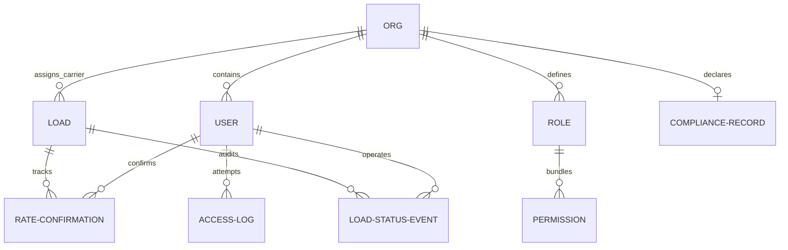

# LoadFlow — Technical Documentation & Operations Guide

Welcome to the official technical documentation for **LoadFlow**, a high-performance freight brokerage operations suite. This document provides a comprehensive breakdown of the application architecture, implemented feature set, design patterns, database structure, and technical stack details.

---

## 1. Executive Summary & Purpose

LoadFlow is designed to streamline logistics operations between three core user types: **Shippers**, **Brokers**, and **Carriers**. In the freight brokerage industry, the broker acts as the intermediary, bearing significant legal liability. Dispatching shipments to non-compliant carriers (e.g., lapsed insurance, suspended MC/DOT authority, or wrong equipment) exposes the brokerage to massive claims.

LoadFlow solves this operational risk by building a **fail-safe compliance gating engine** on top of a secure, dynamic **Role-Based Access Control (RBAC)** architecture. Every critical transaction—carrier assignment, rate signing, and status updates—is validated in real-time at the API boundary.

---

## 2. Technology Stack

The application is built using a modern, lightweight, and single-port runtime stack that runs with zero npm compile times or heavy external dependencies.

*   **Backend Framework:** `FastAPI` (Python 3.10+)
    *   *Why:* Offers high-performance asynchronous endpoints, built-in validation via Pydantic, and fast, readable API routing.
*   **Database ORM:** `SQLAlchemy` (SQLite 3 database)
    *   *Why:* Promotes clean object-relational mapping, strict constraint enforcement (foreign keys, uniques), and database-agnostic scalability.
*   **Authentication:** JWT Session Cookies (`PyJWT` & `bcrypt`)
    *   *Why:* Decentralized state-free sessions signed securely using `HS256`, securely stored as `HttpOnly`, `SameSite=Strict` cookies.
*   **Frontend Interface:** Single Page Application (HTML5 + vanilla JavaScript + Tailwind CSS + Lucide Icons)
    *   *Why:* Maximizes loading speed, eliminates heavy JavaScript framework build steps, and delivers a stunning dark-mode UI with smooth micro-interactions.

---

## 3. Database Schema Design (Entity Models)

The data layer is defined in `backend/models.py`. It uses a fully relational SQLite database (`dev.db`).



### Table Specifications:
1.  **`organizations` (Org):**
    *   Attributes: `id` (UUID), `name`, `type` (`BROKER`, `CARRIER`, `SHIPPER`).
2.  **`users` (User):**
    *   Attributes: `id` (UUID), `email`, `password_hash`, `account_type` (`SHIPPER`, `BROKER_STAFF`, `CARRIER_STAFF`), `org_id` (foreign key), `role_id` (foreign key).
3.  **`roles` (Role):**
    *   Attributes: `id` (UUID), `name`, `org_id` (foreign key). Custom roles are org-scoped.
4.  **`permissions` (Permission):**
    *   Attributes: `key` (primary key string, e.g., `load.assign_carrier`).
5.  **`role_permissions` (Association table):**
    *   Maps Roles to Permissions (Many-to-Many).
6.  **`carrier_compliance_records` (CarrierComplianceRecord):**
    *   Attributes: `id` (UUID), `carrier_org_id` (foreign key), `insurance_expiry_date` (datetime), `mc_dot_authority_status` (`ACTIVE`/`INACTIVE`), `approved_equipment_types` (JSON list), `approved_commodity_types` (JSON list), `last_updated_at` (datetime).
7.  **`loads` (Load):**
    *   Attributes: `id` (UUID), `shipper_id` (foreign key), `broker_org_id` (foreign key), `assigned_carrier_org_id` (foreign key, nullable), `state` (Enum), `compliance_flag` (boolean), `compliance_reason` (string, nullable), `current_rate_confirmation_id` (foreign key, nullable), `required_equipment_type` (string), `required_commodity_type` (string), `pod_url` (string, nullable), `created_at` (datetime).
8.  **`rate_confirmations` (RateConfirmation):**
    *   Attributes: `id` (UUID), `load_id` (foreign key), `version` (int), `base_rate` (float), `accessorials` (JSON string), `confirmed_by_user_id` (foreign key), `confirmed_at` (datetime).
9.  **`load_status_events` (LoadStatusEvent):**
    *   Attributes: `id` (UUID), `load_id` (foreign key), `from_state` (string, nullable), `to_state` (string), `changed_by_user_id` (foreign key), `timestamp` (datetime), `note` (string).
10. **`access_logs` (AccessLog):**
    *   Attributes: `id` (UUID), `user_id` (foreign key), `user_email` (string), `org_id` (foreign key), `attempted_permission` (string), `endpoint` (string), `timestamp` (datetime), `reason` (string).

---

## 4. Key Operational Features

### A. Dynamic Role-Based Access Control (RBAC)
Unlike systems with hardcoded roles, LoadFlow allows organization administrators (Broker Admin or Carrier Admin) to dynamically define roles from a standard **permission catalog** (e.g. `load.create`, `load.assign_carrier`, `rate.confirm`). These roles are then assigned to staff members.
*   Security check points intercept every inbound API request, decode the JWT cookie session, fetch database permission joins, and verify authorizations.

### B. Multi-Tenant Organization Boundary Scoping
Users are partitioned strictly by organization boundaries:
*   **Shippers** can only see loads where they are designated as the `shipper_id`.
*   **Carrier Staff** can only view loads assigned to their `org_id`.
*   **Broker Staff** can view loads scoped to their broker entity.
Data filters are injected at the query-builder level (`backend/rbac.py`) before database execution, preventing horizontal privilege escalation.

### C. State Machine Shipment Lifecycle
The shipment state moves along a strict sequential lifecycle:
`POSTED` ➔ `CARRIER_ASSIGNED` ➔ `RATE_CONFIRMED` ➔ `DISPATCHED` ➔ `IN_TRANSIT` ➔ `DELIVERED` ➔ `POD_VERIFIED` ➔ `INVOICED_CLOSED`
*   **State transition restrictions:** Users cannot skip states (e.g., moving directly from `POSTED` to `DISPATCHED` is blocked) unless they hold the `load.override_compliance_flag` security bypass clearance.

### D. Automated Compliance Engine
When a broker assigns a carrier to a load, the server automatically computes compliance parameters:
1.  **Insurance Check:** Validates that the carrier's `insurance_expiry_date` is in the future.
2.  **Authority Status Check:** Checks that the carrier's `mc_dot_authority_status` is explicitly `'ACTIVE'`.
3.  **Capability Check:** Checks that the load's `required_equipment_type` and `required_commodity_type` exist within the carrier's list of approved types.
If any check fails, the load's `compliance_flag` is set to `True`, and a detailed infraction reason is recorded. Furthermore, updating a compliance certificate triggers an automatic system-wide recheck of all active loads assigned to that carrier.

### E. Compliance Bypasses & Justification Logging
If a load is flagged as non-compliant:
*   API endpoints block transitions past `CARRIER_ASSIGNED` (e.g., signing rate sheets or dispatching).
*   An authorized broker dispatcher (holding the override permission) can perform a **Manual Compliance Override**, which prompts them for a text justification. This action clears the lock, records the audit logs, and allows the load lifecycle to proceed.

### F. Security Violation Auditing
Whenever a user attempts to execute an API action they are not authorized for (e.g., a carrier driver trying to assign carriers, or a broker staff trying to override compliance without credentials), the server:
1.  Blocks the request with a `403 Forbidden` response.
2.  Writes a record containing the operator's email, target endpoint, required permission, timestamp, and block details into the `AccessLog` table. This log is readable in real-time via the Broker Admin security portal.

---

## 5. Directory & Codebase Walkthrough

```text
├── backend/
│   ├── __init__.py
│   ├── auth.py         # Password hashes, JWT generation/decoding, session guards
│   ├── compliance.py   # Expiration dates, MC/DOT, equipment array compatibility checkers
│   ├── database.py     # SQLAlchemy connection engines and DB session factory
│   ├── main.py         # FastAPI endpoint routers, schemas, static files serving mount
│   ├── models.py       # SQL model schema structures (SQLAlchemy models)
│   ├── rbac.py         # Dynamic privilege gateways and multi-tenant scoping filters
│   └── seed.py         # SQLite tables dropper, builder, and initial demo seeder
├── scripts/
│   └── verify_rbac.py  # End-to-end Python test script validating security/compliance
├── static/
│   └── index.html      # Dark-mode Single Page Application dashboard frontend
├── requirements.txt    # Python PIP package requirements list
├── README.md           # Instructions on launching the server locally
└── NOTES.md            # Brief developer design summaries
```

---

## 6. Verification and Testing

To verify the logic and security gates, the repository includes a Python test script (`scripts/verify_rbac.py`):
```bash
python scripts/verify_rbac.py
```
This script automates the following scenarios:
1.  Logs in as a Carrier Driver and attempts to assign a carrier to a load (expects `403 Forbidden`).
2.  Queries the database `AccessLog` table to verify the block was audited with proper details.
3.  Logs in as a Broker Admin, assigns a compliant carrier, confirms a rate, transitions the load sequentially through dispatch/delivery, uploads a mock POD, and closes out the transaction.

---

## 7. Developer Team Launch Guide

Follow these steps to run the platform locally:

1.  **Install dependencies:**
    ```bash
    pip install -r requirements.txt
    ```
2.  **Seed the SQLite Database:**
    ```bash
    python -m backend.seed
    ```
3.  **Run the local development server:**
    ```bash
    python -m uvicorn backend.main:app --reload --port 3000
    ```
4.  Open [http://localhost:3000](http://localhost:3000) to view the operations panel. Use the **Quick Login** profiles to test roles instantly!
